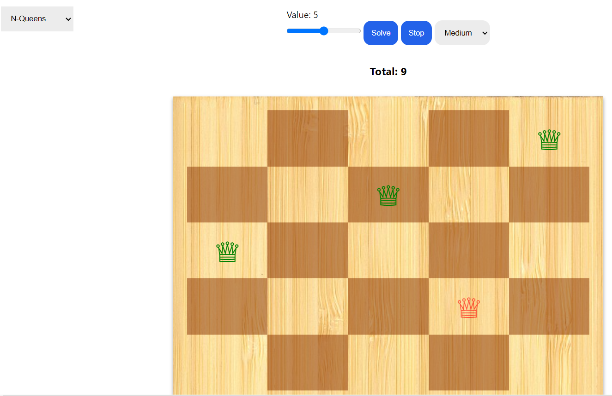
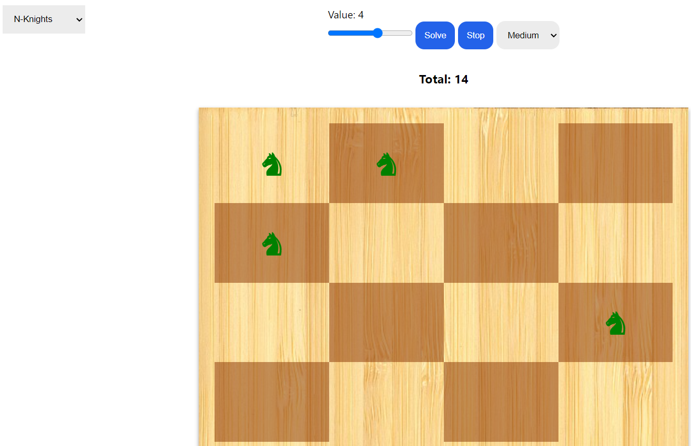
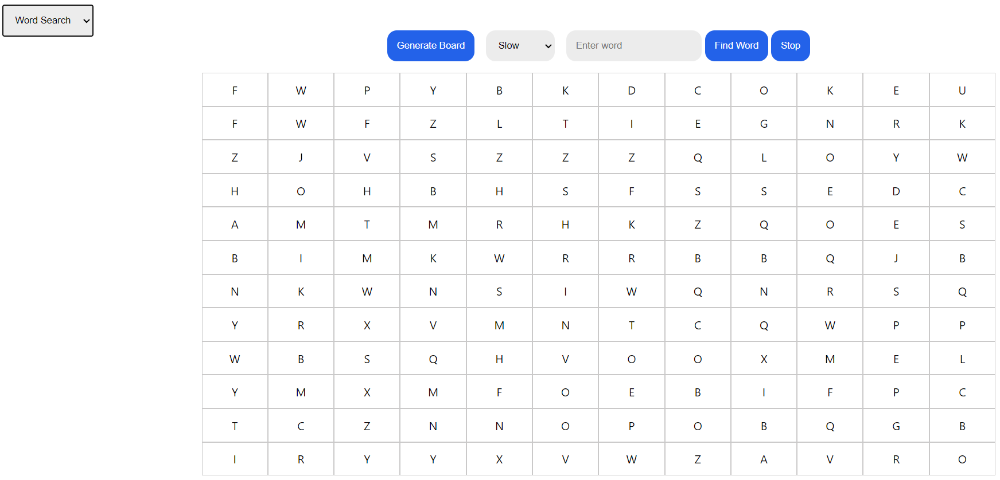

# BackTracking Visualizer

Visualization app that displays the solving process of four backtracking problems:

- N-Queens
- N-Knights
- Word-Search

Click here for a <a target="_blank" href=""> DEMO </a>

## Setup

Clone the repository

```
$ git clone
```

```
$ npm run build
```

## About

A backtracking visualizer for problems like N-Queens, Knights Tour, and word search serves as an interactive tool to demonstrate the backtracking algorithm in action. These problems are classic examples where backtracking is commonly used to find solutions efficiently. Here's how each of these visualizers typically works:

### N-Queens Backtracking Visualizer:

Problem Description: The N-Queens problem involves placing N chess queens on an N×N chessboard so that no two queens threaten each other.

User Interface: The visualizer provides a chessboard grid where users can interactively place queens. It also includes controls to start, pause, and reset the visualization, and options to select the board size (N).

Backtracking Algorithm: As queens are placed on the board, the visualizer uses backtracking to explore all possible configurations, backtracking whenever it reaches a dead end where queens threaten each other.

Visualization: The visualizer highlights valid and invalid positions for queens and visually demonstrates how backtracking works by reverting to previous configurations when necessary.

### Knights Tour Backtracking Visualizer:

Problem Description: The Knights Tour problem involves finding a sequence of moves for the knight on a chessboard such that the knight visits every square exactly once.

User Interface: Similar to the N-Queens visualizer, it provides a chessboard grid and controls for user interaction and customization.

Backtracking Algorithm: The visualizer uses backtracking to explore all possible knight moves, marking visited squares and backtracking when no more valid moves are possible.

Visualization: Users can see the knight moving across the board, highlighting visited squares and backtracking steps, providing a clear understanding of the algorithm's progress.

### Word Finder (Word Search) Backtracking Visualizer:

Problem Description: In a word search puzzle, the goal is to find words hidden within a grid of letters.

User Interface: The visualizer presents a grid of letters representing the word search puzzle, along with a list of words to find. Users can select letters on the grid to form words.

Backtracking Algorithm: The visualizer employs backtracking to search for words within the grid, exploring all possible paths and backtracking when a word cannot be formed or when a dead end is reached.

Visualization: As users select letters and form words, the visualizer highlights the selected path, providing feedback on the progress of the word search.






